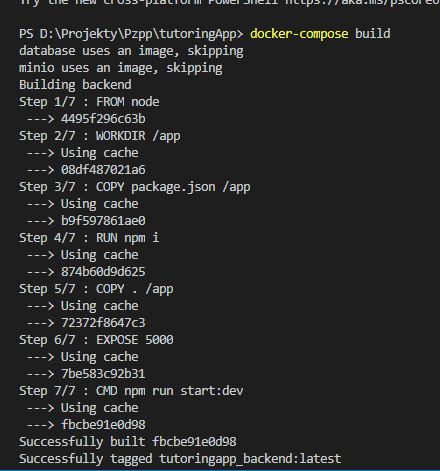
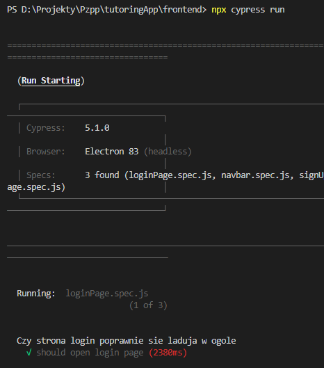
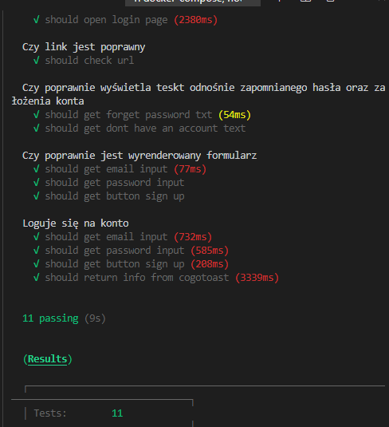
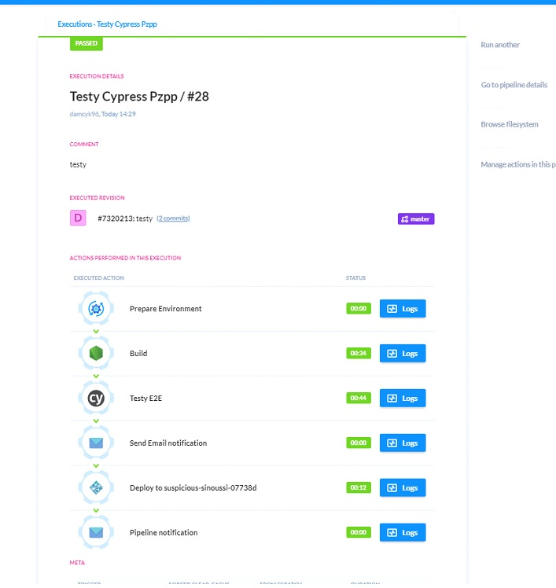

# LEARNY

## Zarządzanie korepetycjami nigdy nie było prostsze.

#### Aplikacja służąca do zarządzania korepetycjami.

## Kwestie warte wspomnienia dot. stacku technologicznego.

- Cały projekt jest stworzony przy użyciu aktualnych technologii wykorzystywanych na rynku pracy jak: React, Nest.js, GraphQL itd.
- Wdrożony [Docker][docker] compose 
  
- Testy End-2-End wykonane w [Cypress][cypress] 
  
  
- Automatyzacja developmentu (np. testów) przy użyciu [Buddy][buddy] 
  
- Wykorzystanie kilku wzorców projektowych.

## Specyfikacja biznesowa (w trakcie rozwoju)

- [Plany rozwoju aplikacji][roadmap]

## Use Case Diagram

- [Use Case][usecase]

## Wybrane technologie

- [Stack technologiczny][stack]

## Schemat bazy danych

- [Schemat DB][database]

## Design

- [Design - strona domowa][home]
  - [Rejestracja][signup]
  - [Logowanie][login]
  - [Panel nauczyciela][panel]
  - [Wyszukiwanie lekcji][find-lesson]
  - [Rezerwowanie lekcji][book]

[home]: docs/home.md
[signup]: docs/signup.md
[login]: docs/login.md
[panel]: docs/panel.md
[find-lesson]: docs/find-lesson.md
[book]: docs/book.md
[roadmap]: docs/roadmap.md
[database]: docs/database.md
[stack]: /docs/stack.md
[usecase]: /docs/usecase.md
[buddy]: buddy.works
[cypress]: https://www.cypress.io/
[docker]: https://www.docker.com/

## Get in Touch

- [GitHub Issues][issues]

[issues]: "https://github.com/trojano31/tutoringApp/issues

## Run project in dev mode (hot reloading)

\$ `docker-compose up`

If any changes are made to Dockerfiles you have to run `docker-compose build`

(this will take some time on the 1st time as it has to build the images)

- Frontend :3000
- Backend :5000
- Database :5432
